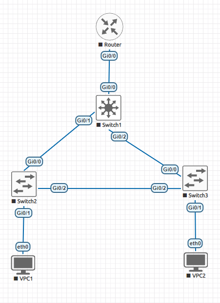

# Лаболаторная работа 1

Лаболаторная работа в файле `hw1.unl`

### Схема сети:




### Настройка компонентов:
* VPC1:
  ```
  VPCS> ip 10.0.10.1/24 10.0.10.100
  Checking for duplicate address...
  VPCS : 10.0.10.1 255.255.255.0 gateway 10.0.10.100
  ```
* VPC2:
  ```
  VPCS> ip 10.0.20.1/24 10.0.20.100
  Checking for duplicate address...
  VPCS : 10.0.20.1 255.255.255.0 gateway 10.0.20.100
  ```
* Switch2 (уровень доступа)
  ```
  Switch>enable
  Switch#configure terminal
  Enter configuration commands, one per line.  End with CNTL/Z.
  Switch(config)#vlan 10
  Switch(config-vlan)#exit
  Switch(config)#vlan 20
  Switch(config-vlan)#exit
  Switch(config)#interface Gi0/1
  Switch(config-if)#switchport mode access
  Switch(config-if)#switchport access vlan 10
  Switch(config-if)#exit
  Switch(config)#interface Gi0/0
  Switch(config-if)#switchport trunk encapsulation dot1q
  Switch(config-if)#switchport mode trunk
  Switch(config-if)#switchport trunk allowed vlan 10,20
  Switch(config-if)#exit
  Switch(config)#interface Gi0/2
  Switch(config-if)#switchport trunk encapsulation dot1q
  Switch(config-if)#switchport mode trunk
  Switch(config-if)#switchport trunk allowed vlan 10,20
  Switch(config-if)#exit
  Switch(config)#exit
  ```
* Switch3 (уровень доступа): то же самое, что и для Switch2, с изменением `vlan 10` на `vlan 20` в порту `Gi0/1`
* Switch1 (ядро сети)
  ```
  ... Настраиваем VLAN-ы как в Switch2 ...
  ... Настраиваем все порты как Gi0/0 из Switch2 ...
  Switch(config)#spanning-tree mode pvst
  Switch(config)#spanning-tree extend system-id
  Switch(config)#spanning-tree vlan 10,20 priority 0
  ```
* Router
  ```
  Router>enable
  Router#configure ter
  Enter configuration commands, one per line.  End with CNTL/Z.
  Router(config)#int Gi0/0
  Router(config-if)#no shutdown
  Router(config-if)#exit
  Router(config)#exit
  Router(config)#interface Gi0/0.10
  Router(config-subif)#encapsulation dot1q 10
  Router(config-subif)#ip address 10.0.10.100 255.255.255.0
  Router(config-subif)#exit
  Router(config)#interface Gi0/0.20
  Router(config-subif)#encapsulation dot1q 20
  Router(config-subif)#ip address 10.0.20.100 255.255.255.0
  Router(config-subif)#exit
  Router(config)#exit
  ```
### Проверка доступности:
```
# VPC1 -> VPC2
VPCS> ping 10.0.20.1

84 bytes from 10.0.20.1 icmp_seq=1 ttl=63 time=10.082 ms
84 bytes from 10.0.20.1 icmp_seq=2 ttl=63 time=6.109 ms
84 bytes from 10.0.20.1 icmp_seq=3 ttl=63 time=6.324 ms
84 bytes from 10.0.20.1 icmp_seq=4 ttl=63 time=5.798 ms
84 bytes from 10.0.20.1 icmp_seq=5 ttl=63 time=5.988 ms

# VPC2 -> VPC1
VPCS> pin 10.0.10.1

84 bytes from 10.0.10.1 icmp_seq=1 ttl=63 time=7.258 ms
84 bytes from 10.0.10.1 icmp_seq=2 ttl=63 time=6.187 ms
84 bytes from 10.0.10.1 icmp_seq=3 ttl=63 time=5.264 ms
84 bytes from 10.0.10.1 icmp_seq=4 ttl=63 time=6.708 ms
84 bytes from 10.0.10.1 icmp_seq=5 ttl=63 time=5.927 ms
```

### Проверка полученного Spanning Tree
В приведенных выводах я оставил только релевантрную информацию
```
# Switch1
Switch>show spanning-tree

VLAN0010
Interface           Role Sts Cost      Prio.Nbr Type
------------------- ---- --- --------- -------- --------------------------------
Gi0/0               Desg FWD 4         128.1    P2p
Gi0/1               Desg FWD 4         128.2    P2p
Gi0/2               Desg FWD 4         128.3    P2p

VLAN0020
Interface           Role Sts Cost      Prio.Nbr Type
------------------- ---- --- --------- -------- --------------------------------
Gi0/0               Desg FWD 4         128.1    P2p
Gi0/1               Desg FWD 4         128.2    P2p
Gi0/2               Desg FWD 4         128.3    P2p

# Switch2
Switch>show spanning-tree

VLAN0010
Interface           Role Sts Cost      Prio.Nbr Type
------------------- ---- --- --------- -------- --------------------------------
Gi0/0               Root FWD 4         128.1    P2p
Gi0/1               Desg FWD 4         128.2    P2p
Gi0/2               Desg FWD 4         128.3    P2p

VLAN0020
Interface           Role Sts Cost      Prio.Nbr Type
------------------- ---- --- --------- -------- --------------------------------
Gi0/0               Root FWD 4         128.1    P2p
Gi0/2               Desg FWD 4         128.3    P2p

# Switch3
Switch>show spanning-tree

VLAN0010
Interface           Role Sts Cost      Prio.Nbr Type
------------------- ---- --- --------- -------- --------------------------------
Gi0/0               Root FWD 4         128.1    P2p
Gi0/2               Altn BLK 4         128.3    P2p

VLAN0020
Interface           Role Sts Cost      Prio.Nbr Type
------------------- ---- --- --------- -------- --------------------------------
Gi0/0               Root FWD 4         128.1    P2p
Gi0/1               Desg FWD 4         128.2    P2p
Gi0/2               Altn BLK 4         128.3    P2p

```
Мы видим, что линк из Switch3 в Switch2 действительно заблокировался в обеих сетях.

### Проверка отказоустойчивости
Выключаем `Gi0/2` в Switch2:

```
Switch>enable
Switch#conf term
Enter configuration commands, one per line.  End with CNTL/Z.
Switch(config)#int Gi0/2
Switch(config-if)#shutdown
Switch(config-if)#exit
Switch(config)#exit
Switch#
```

Проверяем пинги:
```
# VPC1 -> VPC2
VPCS> ping 10.0.20.1

84 bytes from 10.0.20.1 icmp_seq=1 ttl=63 time=10.104 ms
84 bytes from 10.0.20.1 icmp_seq=2 ttl=63 time=7.729 ms
84 bytes from 10.0.20.1 icmp_seq=3 ttl=63 time=6.316 ms
84 bytes from 10.0.20.1 icmp_seq=4 ttl=63 time=9.603 ms
84 bytes from 10.0.20.1 icmp_seq=5 ttl=63 time=6.422 ms

# VPC2 -> VPC1
VPCS> pin 10.0.10.1

84 bytes from 10.0.10.1 icmp_seq=1 ttl=63 time=8.390 ms
84 bytes from 10.0.10.1 icmp_seq=2 ttl=63 time=6.092 ms
84 bytes from 10.0.10.1 icmp_seq=3 ttl=63 time=7.069 ms
84 bytes from 10.0.10.1 icmp_seq=4 ttl=63 time=6.744 ms
84 bytes from 10.0.10.1 icmp_seq=5 ttl=63 time=6.062 ms
```